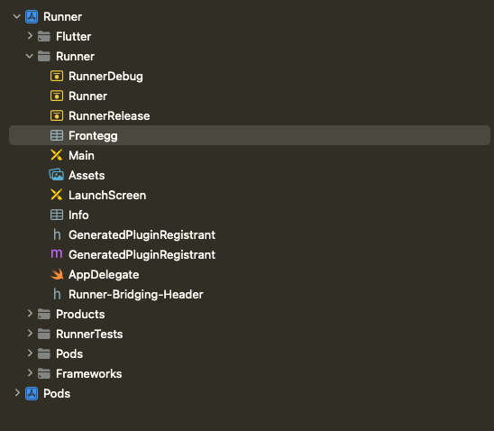

# frontegg_flutter

Frontegg is a first-of-its-kind full-stack user management platform, empowering software teams with user infrastructure
features for the product-led era.

## Table of Contents

- [frontegg\_flutter](#frontegg_flutter)
  - [Table of Contents](#table-of-contents)
  - [Project Requirements](#project-requirements)
  - [Getting Started](#getting-started)
    - [Prepare Frontegg workspace](#prepare-frontegg-workspace)
    - [Add frontegg package to the project](#add-frontegg-package-to-the-project)
  - [Setup iOS Project](#setup-ios-project)
    - [Create Frontegg plist file](#create-frontegg-plist-file)
    - [Handle Open App with URL](#handle-open-app-with-url)
    - [`For Objective-C:`](#for-objective-c)
    - [`For Swift:`](#for-swift)
    - [Handle Open App with URL](#handle-open-app-with-url-1)
    - [Config iOS associated domain](#config-ios-associated-domain)
    - [Multi-apps iOS Support](#multi-apps-ios-support)
    - [Logout User after application was uninstall](#logout-user-after-application-was-uninstall)
    - [Custom Loader](#custom-loader)
  - [Setup Android Project](#setup-android-project)
    - [Set minimum sdk version](#set-minimum-sdk-version)
    - [Configure build config fields](#configure-build-config-fields)
    - [Add permissions to AndroidManifest.xml](#add-permissions-to-androidmanifestxml)
    - [Config Android AssetLinks](#config-android-assetlinks)
    - [Enabling Chrome Custom Tabs for Social Login](#enabling-chrome-custom-tabs-for-social-login)
    - [Multi-apps Android Support](#multi-apps-android-support)
    - [Custom Loader](#custom-loader)
  - [Usages](#usages)
    - [Wrap your root Widget with FronteggProvider:](#wrap-your-root-widget-with-fronteggprovider)
    - [Access to frontegg instance](#access-to-frontegg-instance)
    - [Login with frontegg](#login-with-frontegg)
    - [Switch tenant frontegg](#switch-tenant-frontegg)
    - [Frontegg state](#frontegg-state)
    - [Other frontegg features:](#other-frontegg-features)
- [Knowing Issues](#knowing-issues)
  - [Android](#android)
## Project Requirements

- Minimum iOS deployment version **=> 14**
- Min Android SDK **=> 26**

## Getting Started

### Prepare Frontegg workspace

Navigate to [Frontegg Portal Settings](https://portal.frontegg.com/development/settings), If you don't have application
follow integration steps after signing up.
Copy FronteggDomain to future steps
from [Frontegg Portal Domain](https://portal.frontegg.com/development/settings/domains)

- Navigate to [Login Method Settings](https://portal.frontegg.com/development/authentication/hosted)
- Toggle Hosted login method for iOS:
    - Add `{{IOS_BUNDLE_IDENTIFIER}}://{{FRONTEGG_BASE_URL}}/ios/oauth/callback`
- Toggle Hosted login method for Android:
    - Add `{{ANDROID_PACKAGE_NAME}}://{{FRONTEGG_BASE_URL}}/android/oauth/callback`
    - Add `https://{{FRONTEGG_BASE_URL}}/oauth/account/redirect/android/{{ANDROID_PACKAGE_NAME}}`
- Add `{{FRONTEGG_BASE_URL}}/oauth/authorize`
- Replace `IOS_BUNDLE_IDENTIFIER` with your application identifier
- Replace `FRONTEGG_BASE_URL` with your frontegg base url
- Replace `ANDROID_PACKAGE_NAME` with your android package name


### Add frontegg package to the project

Use a package manager pab to install frontegg Flutter library.

**Terminal:**

```bash
dart pub add frontegg_flutter
```

**Or manually:**

```yaml
dependencies:
  frontegg_flutter: ^1.0.0
```

## Setup iOS Project

### Create Frontegg plist file

To setup your SwiftUI application to communicate with Frontegg, you have to create a new file named `Frontegg.plist`
under
your ios project directory(for example ios/Runner) and include the file to your XCode project, this file will store values to be used variables by Frontegg SDK:

How it can look:



`Frontegg.plist`:

```xml
<?xml version="1.0" encoding="UTF-8"?>
<!DOCTYPE plist PUBLIC "-//Apple//DTD PLIST 1.0//EN" "http://www.apple.com/DTDs/PropertyList-1.0.dtd">
<plist version="1.0">
    <dict>
        <key>baseUrl</key>
        <string>https://[DOMAIN_HOST_FROM_PREVIOUS_STEP]</string>
        <key>clientId</key>
        <string>[CLIENT_ID_FROM_PREVIOUS_STEP]</string>
    </dict>
</plist>
```

### Handle Open App with URL

To handle Login with magic link and other authentication methods that require to open the app with a URL, you have to
add the following code to.

### `For Objective-C:`

1. Create `FronteggSwiftAdapter.swift` in your project and add the following code:

    ```objective-c
    //  FronteggSwiftAdapter.swift
    
    import Foundation
    import FronteggSwift
    
    @objc(FronteggSwiftAdapter)
    public class FronteggSwiftAdapter: NSObject {
        @objc public static let shared = FronteggSwiftAdapter()
    
        @objc public func handleOpenUrl(_ url: URL) -> Bool {
            return FronteggAuth.shared.handleOpenUrl(url)
        }
    }
    ```

2. Open `AppDelegate.m` file and import swift headers:

    ```objective-c
    #import <[YOUR_PROJECT_NAME]-Swift.h>
    ```
3. Add URL handlers to `AppDelegate.m`:

    ```objective-c
    #import <[YOUR_PROJECT_NAME]-Swift.h>
   
   // ...CODE...
   
   - (BOOL)application:(UIApplication *)app openURL:(NSURL *)url
            options:(NSDictionary<UIApplicationOpenURLOptionsKey, id> *)options
    {
      
      if([[FronteggSwiftAdapter shared] handleOpenUrl:url] ){
        return TRUE;
      }
      return [RCTLinkingManager application:app openURL:url options:options];
    }
    
    - (BOOL)application:(UIApplication *)application continueUserActivity:(nonnull NSUserActivity *)userActivity
     restorationHandler:(nonnull void (^)(NSArray<id<UIUserActivityRestoring>> * _Nullable))restorationHandler
    {
      
      if (userActivity.webpageURL != NULL){
        if([[FronteggSwiftAdapter shared] handleOpenUrl:userActivity.webpageURL] ){
          return TRUE;
        }
      }
     return [RCTLinkingManager application:application
                      continueUserActivity:userActivity
                        restorationHandler:restorationHandler];
    }
    ```

### `For Swift:`

1. Add URL handlers to `AppDelegate.swift`:
    ```swift  
    import UIKit
    import Flutter

    import FronteggSwift
    
    @main
    @objc class AppDelegate: FlutterAppDelegate {
    
        /*
         * Called when the app was launched with a url. Feel free to add additional processing here,
         * but if you want the App API to support tracking app url opens, make sure to keep this call
         */
        func application(_ app: UIApplication, open url: URL, options: [UIApplication.OpenURLOptionsKey: Any] = [:]) -> Bool {
            
            if(FronteggAuth.shared.handleOpenUrl(url, true)){
                return true
            }
            
            return ApplicationDelegateProxy.shared.application(app, open: url, options: options)
        }
        
        /*
         * Called when the app was launched with an activity, including Universal Links.
         * Feel free to add additional processing here, but if you want the App API to support
         * tracking app url opens, make sure to keep this call
         */
        func application(_ application: UIApplication, continue userActivity: NSUserActivity, restorationHandler: @escaping ([UIUserActivityRestoring]?) -> Void) -> Bool {
            
            if let url = userActivity.webpageURL {
                if(FronteggAuth.shared.handleOpenUrl(url, true)){
                    return true
                }
            }
            return ApplicationDelegateProxy.shared.application(application, continue: userActivity, restorationHandler: restorationHandler)
        }
    }
    ```

### Handle Open App with URL

### Config iOS associated domain

Configuring your iOS associated domain is required for Magic Link authentication / Reset Password / Activate Account.

In order to add your iOS associated domain to your Frontegg application, you will need to update in each of your
integrated Frontegg Environments the iOS associated domain that you would like to use with that Environment. Send a POST
request to `https://api.frontegg.com/vendors/resources/associated-domains/v1/ios` with the following payload:

```
{
    “appId”:[YOUR_ASSOCIATED_DOMAIN]
}
```

In order to use our API’s, follow [this guide](‘https://docs.frontegg.com/reference/getting-started-with-your-api’) to
generate a vendor token.


Next, you will need to add your associated domain to your iOS application. To do so, follow the steps below:

1. Open your project in Xcode.
2. Select your project in the Project Navigator.
3. Select your target.
4. Select the Signing & Capabilities tab.
5. Expand the Associated Domains section.
6. Click the + button.
7. Enter your associated domain in the format `applinks:[YOUR_ASSOCIATED_DOMAIN]`.
7. Enter your associated domain in the format `webcredentials:[YOUR_ASSOCIATED_DOMAIN]`.
8. Click Done.


`[YOUR_ASSOCIATED_DOMAIN]` is the associated domain that you would like to use with your iOS application.
For example, if you would like to use `https://example.com` as your associated domain, you would
enter `applinks:example.com` and `webcredentials:example.com`.

## Multi-apps iOS Support

This guide outlines the steps to configure your iOS application to support multiple applications.

### Step 1: Modify the Frontegg.plist File

Add `applicationId` to Frontegg.plist file:

```xml
<plist version="1.0">
  <dict>
    <key>applicationId</key>  
    <string>your-application-id-uuid</string>
    <key>baseUrl</key>
    <string>https://your-domain.fronteg.com</string>
    <key>clientId</key>
    <string>your-client-id-uuid</string>
  </dict>
</plist>
```

### Logout User after application was uninstall

If you want that user not to keep logged in after reinstalling an application please add the `keepUserLoggedInAfterReinstall` property to the `Frontegg.plist` file:

```xml
<plist version="1.0">
  <dict>
    <key>keepUserLoggedInAfterReinstall</key>
    <false/>
    ...
  </dict>
</plist>
```

By default `keepUserLoggedInAfterReinstall` is `true`.


### Custom Loader

To customize the loader for iOS when using Embedded mode, you can set up a custom loader by modifying your `AppDelegate.swift` file.
The custom loader will be displayed during authentication processes.

First, ensure that Embedded mode is enabled in your configuration.
```plist
 <plist version="1.0">
<dict>
	<key>embeddedMode</key>
	<true/>
	...
</dict>
</plist>
```

Here's how to implement a custom loader:

```swift
import SwiftUI
import FronteggSwift

@main
@objc class AppDelegate: FlutterAppDelegate {
    override func application(
        _ application: UIApplication,
        didFinishLaunchingWithOptions launchOptions: [UIApplication.LaunchOptionsKey: Any]?
    ) -> Bool {
         ...
        // Setup Loader for Frontegg Embedded Loading
        // Can be any view
        DefaultLoader.customLoaderView = AnyView(Text("Loading..."))
        
        return super.application(application, didFinishLaunchingWithOptions: launchOptions)
    }
    ...
}
```

## Setup Android Project

### Set minimum sdk version

To set up your Android minimum sdk version, open root gradle file at`android/build.gradle`,
and add/edit the `minSdkVersion` under `buildscript.ext`:

```groovy
buildscript {
    ext {
        minSdkVersion = 26
        // ...
    }
}
```

### Configure build config fields

To set up your Android application on to communicate with Frontegg, you have to add `buildConfigField` property the
gradle `android/app/build.gradle`.
This property will store frontegg hostname (without https) and client id from previous step:

```groovy

def fronteggDomain = "FRONTEGG_DOMAIN_HOST.com" // without protocol https://
def fronteggClientId = "FRONTEGG_CLIENT_ID"

android {
    defaultConfig {

        manifestPlaceholders = [
                "package_name" : applicationId,
                "frontegg_domain" : fronteggDomain,
                "frontegg_client_id": fronteggClientId
        ]

        buildConfigField "String", 'FRONTEGG_DOMAIN', "\"$fronteggDomain\""
        buildConfigField "String", 'FRONTEGG_CLIENT_ID', "\"$fronteggClientId\""
        buildConfigField "Boolean", 'FRONTEGG_USE_ASSETS_LINKS', "true" /** For using frontegg domain for deeplinks **/
        buildConfigField "Boolean", 'FRONTEGG_USE_CHROME_CUSTOM_TABS', "true"  /** For using custom chrome tab for social-logins **/
    }
    
    
}
```

Note: 
`FRONTEGG_USE_ASSETS_LINKS` by default is `true`.
`FRONTEGG_USE_CHROME_CUSTOM_TABS` by default is `true`. 
So, if you do not set up those values we will use values by default.

Add bundleConfig=true if not exists inside the android section inside the app gradle `android/app/build.gradle`

```groovy
android {
  buildFeatures {
    buildConfig = true
  }
}
```

### Config Android AssetLinks

Configuring your Android `AssetLinks` is required for Magic Link authentication / Reset Password / Activate Account /
login with IdPs.

To add your `AssetLinks` to your Frontegg application, you will need to update in each of your integrated Frontegg
Environments the `AssetLinks` that you would like to use with that Environment. Send a POST request
to `https://api.frontegg.com/vendors/resources/associated-domains/v1/android` with the following payload:

```
{
    "packageName": "YOUR_APPLICATION_PACKAGE_NAME",
    "sha256CertFingerprints": ["YOUR_KEYSTORE_CERT_FINGERPRINTS"]
}
```

Each Android app has multiple certificate fingerprint, to get your `DEBUG` sha256CertFingerprint you have to run the
following command:

For Debug mode, run the following command and copy the `SHA-256` value

NOTE: make sure to choose the Variant and Config equals to `debug`

```bash
./gradlew signingReport

###################
#  Example Output:
###################

#  Variant: debug
#  Config: debug
#  Store: /Users/davidfrontegg/.android/debug.keystore
#  Alias: AndroidDebugKey
#  MD5: 25:F5:99:23:FC:12:CA:10:8C:43:F4:02:7D:AD:DC:B6
#  SHA1: FC:3C:88:D6:BF:4E:62:2E:F0:24:1D:DB:D7:15:36:D6:3E:14:84:50
#  SHA-256: D9:6B:4A:FD:62:45:81:65:98:4D:5C:8C:A0:68:7B:7B:A5:31:BD:2B:9B:48:D9:CF:20:AE:56:FD:90:C1:C5:EE
#  Valid until: Tuesday, 18 June 2052

```

For Release mode, Extract the SHA256 using keytool from your `Release` keystore file:

```bash
keytool -list -v -keystore /PATH/file.jks -alias YourAlias -storepass *** -keypass ***
```

In order to use our API’s, follow [this guide](https://docs.frontegg.com/reference/getting-started-with-your-api) to
generate a vendor token.

### Enabling Chrome Custom Tabs for Social Login

To enable social login using Chrome Custom Tabs within your Android application, you need to modify the `android/app/build.gradle` file. Add a boolean `buildConfigField` for the `FRONTEGG_USE_CHROME_CUSTOM_TABS` flag and set it to true.

By default, the SDK defaults to using the Chrome browser for social login.

 ```groovy

def fronteggDomain = "FRONTEGG_DOMAIN_HOST.com" // without protocol https://
def fronteggClientId = "FRONTEGG_CLIENT_ID"

android {
    defaultConfig {

        manifestPlaceholders = [
                "package_name" : applicationId,
                "frontegg_domain" : fronteggDomain,
                "frontegg_client_id": fronteggClientId
        ]

        buildConfigField "String", 'FRONTEGG_DOMAIN', "\"$fronteggDomain\""
        buildConfigField "String", 'FRONTEGG_CLIENT_ID', "\"$fronteggClientId\""
        
        buildConfigField "Boolean", 'FRONTEGG_USE_CHROME_CUSTOM_TABS', "true"
    }
    
    
}
```

## Multi-apps Android Support

This guide outlines the steps to configure your Android application to support multiple applications.

### Step 1: Modify the Build.gradle file

Add `FRONTEGG_APPLICATION_ID` buildConfigField into the `build.gradle` file:

```groovy
def fronteggApplicationId = "your-application-id-uuid"
...
android {
    ...
    buildConfigField "String", 'FRONTEGG_APPLICATION_ID', "\"$fronteggApplicationId\""
}
```

## Custom Loader

To customize the loader for Android when using Embedded Activity mode, you can set up a custom loader by modifying your `MainActivity.kt` file. The custom loader will be displayed during authentication processes.

First, ensure that Embedded Activity mode is enabled in your configuration.

Here's how to implement a custom loader:

```kotlin
import android.content.res.ColorStateList
import android.graphics.Color
import android.os.Bundle
import android.widget.ProgressBar
import com.frontegg.android.ui.DefaultLoader
import io.flutter.embedding.android.FlutterActivity

class MainActivity : FlutterActivity() {
  override fun onCreate(savedInstanceState: Bundle?) {
    super.onCreate(savedInstanceState)

    // Setup Loader for Frontegg Embedded Activity Loading
    DefaultLoader.setLoaderProvider {
      // Can be any view
      val progressBar = ProgressBar(it)
      val colorStateList = ColorStateList.valueOf(Color.GREEN)
      progressBar.indeterminateTintList = colorStateList

      progressBar
    }
  }
}
```

## Usages

### Wrap your root Widget with FronteggProvider:

```dart
import 'package:flutter/material.dart';
import 'package:frontegg_flutter/frontegg_flutter.dart';

class MyApp extends StatelessWidget {
  const MyApp({super.key});

  @override
  Widget build(BuildContext context) {
    return MaterialApp(
      home: FronteggProvider(
        child: const MainPage(),
      ),
    );
  }
}
```

Or Use Provider from the [plugin](https://pub.dev/packages/provider) or other suitable plugin,
don't forget about `dispose` of the `FronteggFlutter`:

```dart
import 'package:flutter/material.dart';
import 'package:frontegg_flutter/frontegg_flutter.dart';
import 'package:provider/provider.dart';

class MyApp extends StatelessWidget {
  const MyApp({super.key});

  @override
  Widget build(BuildContext context) {
    return MaterialApp(
      home: Provider(
        create: (_) => FronteggFlutter(),
        dispose: (_, frontegg) => frontegg.dispose(),
        child: const MainPage(),
      ),
    );
  }
}
```

### Access to frontegg instance

To get the `FronteggFlutter` instance use the Frontegg BuildContext extension down the widget tree:

```dart
class MainPage extends StatelessWidget {
  const MainPage({super.key});

  @override
  Widget build(BuildContext context) {
    final frontegg = context.frontegg;
    return const SizedBox();
  }
}
```


### Login with frontegg

To log in with frontegg you can use the `context`.`frontegg` accessor and call `login` method:

```dart
class MainPage extends StatelessWidget {
  const MainPage({super.key});

  @override
  Widget build(BuildContext context) {
    final frontegg = context.frontegg;
    return Scaffold(
      body: Center(
        child: ElevatedButton(
          child: const Text("Login"),
          onPressed: () async {
            await frontegg.login();
          },
        ),
      ),
    );
  }
}
```

You can prefill the login text field in the login box by adding the loginHint parameter to the login method:

```dart
class MainPage extends StatelessWidget {
  const MainPage({super.key});

  @override
  Widget build(BuildContext context) {
    final frontegg = context.frontegg;
    return Scaffold(
      body: Center(
        child: ElevatedButton(
          child: const Text("Login"),
          onPressed: () async {
            await frontegg.login(loginHint: "some@mail.com");
          },
        ),
      ),
    );
  }
}
```

### Switch tenant frontegg

To switch tenant  with frontegg you can use the `context`.`frontegg` accessor and call `switchTenant` method:

```dart
class MainPage extends StatelessWidget {
  const MainPage({super.key});

  @override
  Widget build(BuildContext context) {
    final frontegg = context.frontegg;
    return Scaffold(
      body: Center(
        child: ElevatedButton(
          child: const Text("Login"),
          onPressed: () async {
            final tenantId = "TENANT_ID";
            await frontegg.switchTenant(tenantId);
          },
        ),
      ),
    );
  }
}
```

### Frontegg state

`FronteggPlugin` has a `FronteggState` and this state is changing according to the plugin flowing:

```dart
class FronteggState {
  final String? accessToken;
  final String? refreshToken;
  final FronteggUser? user;
  final bool isAuthenticated;
  final bool isLoading;
  final bool initializing;
  final bool showLoader;
  final bool appLink;
}
```

To get a state of the `FronteggFlutter` you have two option:

1. Get `currentState`:
   ```dart
    @override
    Widget build(BuildContext context) {
      final frontegg = context.frontegg;
      final fronteggState = frontegg.currentState;
    }
    
   ```
2. Listen `stateChanged` stream:
   ```dart
    import 'package:flutter/material.dart';
    import 'package:frontegg_flutter/frontegg_flutter.dart';
    import 'package:frontegg_flutter_embedded_example/login_page.dart';
    import 'package:frontegg_flutter_embedded_example/user_page.dart';

    class MainPage extends StatelessWidget {
      const MainPage({super.key});

      @override
      Widget build(BuildContext context) {
        final frontegg = context.frontegg;
        return Scaffold(
          body: Center(
            child: StreamBuilder<FronteggState>(
              stream: frontegg.stateChanged,
              builder: (BuildContext context, AsyncSnapshot<FronteggState> snapshot) {
                if (snapshot.hasData) {
                  final state = snapshot.data!;
                  if (state.isAuthenticated && state.user != null) {
                    return const UserPage();
                  } else if (state.initializing) {
                    return const CircularProgressIndicator();
                  } else {
                    return const LoginPage();
                  }
                }

                return const SizedBox();
              },
            ),
          ),
        );
      }
    }
   ```

### Other frontegg features:

Also frontegg give you next features:
  1. `logout` - logs out from `FronteggFlutter`;
  2. `refreshToken` - refreshes `accessToken` and `refreshToken` only if needed, returns `true` if refreshing succeeds;
  3. `getConstants` - returns `Frontegg Flutter` initialize constants;
  4. `directLoginAction` - direct logs in with `type` and `data`;
  5. `registerPasskeys` - registers user passkey;
  6. `loginWithPasskeys` - login with registered user passkey.
  7. `requestAuthorize` - requests authorization using a refresh token and an optional device token cookie.


# Knowing Issues

## Android

If you have experienced with `MissingPluginException`:
```
The following MissingPluginException was thrown while activating platform stream on channel frontegg_flutter/state_stream:
MissingPluginException(No implementation found for method listen on channel frontegg_flutter/state_stream)
```

Add the line to the `proguard-rules.pro` file:

```
-keepclasseswithmembers class com.frontegg.** {*;}
```
